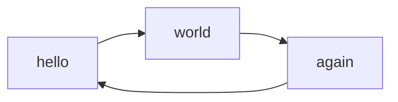

# Arkitektur


## Mermaid


##
```kotlin
    @Test
    fun `Instansen av Aktivitetsloggeren skal være den samme hver gang man henter loggeren`() {
        val aktivitetslogger1 = Aktivitetslogger.logger(rapid)
        val aktivitetslogger2 = Aktivitetslogger.logger(rapid)

        aktivitetslogger2.shouldBeEqual(aktivitetslogger1)
    }
```