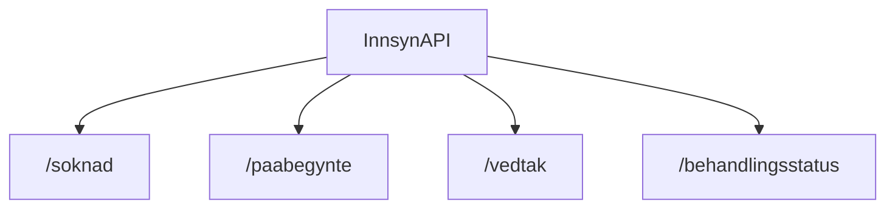

# dp-innsyn

Dette er hovedsakelig backend-løsninger for [**`dp-dagpenger`**][dp-dagpenger] . I tillegg tilbyr denne applikasjonen spesifikke endepunkter for både [**`dp-soknad`**][dp-soknad] og [**`aia-backend`**][aia-backend] eid av team PAW.

## Formål

[**`dp-innsyn`**][dp-innsyn] er utviklet for å forenkle prosessen med å hente informasjon relatert til søknader og vedtak. Kjernefunksjonene omfatter å hente innsendte og påbegynte søknader, hente vedtak samt innhente behandlingsstatus for søknader. I tillegg håndterer applikasjonen hendelser relatert til søknader, vedtak og journaler ved hjelp av hendelsesmottak.

## Teknologier

- Kotlin
- Gradle
- Ktor
- Rapids and rivers
- Postgres
- JUnit
- OpenAPI

## App-arkitektur

### API

Appen bruker OpenAPI for å definere og dokumentere API-et. OpenAPI-spesifikasjonen ligger i [**`innsyn-api.yaml`**][innsyn-api.yaml] filen og dokumentasjonen kan du finne to steder:
1. Åpen versjon på GitHub Pages: https://navikt.github.io/dp-innsyn/
2. Interaktiv versjon som krever naisdevice: https://dp-innsyn.intern.dev.nav.no/innsyn

### Mottak

#### SøknadMottak
> Tar imot søknader og håndterer relaterte hendelser ved å lagre informasjonen i persontabellen.
#### VedtakMottak
> Tar imot vedtak og håndterer relaterte hendelser ved å lagre informasjonen i persontabellen.
#### JournalpostMottak
> Tar imot journalposter og håndterer relaterte hendelser ved å lagre informasjonen i persontabellen.

### Oppslag
- PåbegyntOppslag
  > Henter påbegynte søknader fra [**`dp-soknad`**][dp-soknad].

## Utfordringer

## Lenker

- [dp-innsyn][dp-innsyn]
- [dp-soknad][dp-soknad]
- [dp-dagpenger][dp-dagpenger]
- [aia-backend][aia-backend]

<!-- Lenker -->

[dp-innsyn]: https://github.com/navikt/dp-innsyn
[dp-soknad]: https://github.com/navikt/dp-soknad
[dp-dagpenger]: https://github.com/navikt/dp-dagpenger
[aia-backend]: https://github.com/navikt/aia-backend
[innsyn-api.yaml]: https://github.com/navikt/dp-innsyn/blob/main/openapi/src/main/resources/innsyn-api.yaml
