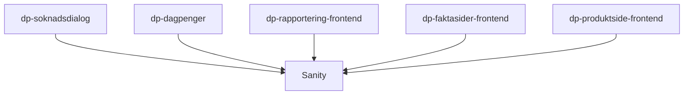

# Frontend

Vi bruker Sanity som CMS for ikke-innloggede sider og innloggede sider for dagpenger.

## Formål

I Sanity ønsker vi å samle alt innhold som innholdsteamet skal kunne redigere.

## Teknologier

## App-arkitektur

TODO:

- Hvordan fungerer applikasjonen internt?
- Hvilke andre applikasjoner kommuniserer denne direkte med?

## Utfordringer

TODO: Hvilke utfordringer har denne applikasjonen? F.eks. med hvordan den er strukturert, vanskelig å oppgradere, utdaterte avhengigheter

## Lenker

- [Github](https://github.com/navikt/dp-sanity-cms-v3)
- Grafana Faro
- Amplitude
- Oppgaver i favro
- Annen bakgrunnsinformasjon
