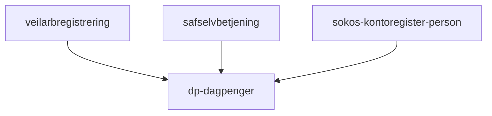

# Frontend

Innsynnside for dagpenger.

## Formål

Bruker skal kunne se oversikt over dagpengersøknader bruker har sendt til NAV. Oversikt over dokumenter. Muligheter for å ta kontakt med NAV.

## Teknologier

- Rammeverk: next 12
- Testing: Jest 27
- Node 18.12.0
- MSW: 1.3.2

## App-arkitektur

Denne applikasjonen har bare èn side.

### Sidestruktur

- PageHero
- Soknader
- AccountNumber
- MeldFraOmEndring
- Shortcut
- JoirnalpostList
- NosessionModal

### Eksterne tjenester / Netverkskart

TODO:

- Hvordan fungerer applikasjonen internt?

## Utfordringer

- Dokument håntering er vanskelig å forstår. Denne trenger omskriving/opprydding.
- Vanskelig å oppdatere til neste Next og MSW.
- Bruker har ikke mulighet å følge med på søknadsstatus.
- Denne applikasjonen mangler oppsett for Faro

## Lenker

- [Github](https://github.com/navikt/dp-dagpenger)
- Grafana Faro
- [Amplitude](https://app.eu.amplitude.com/analytics/nav/dashboard/5z4xqqz)
- Oppgaver i favro
- [Tilgjengelighetserklæring](https://a11y-statement.nav.no/reports/1b32d0fd-983b-44f2-8f64-6f1ae6760c64)
- Annen bakgrunnsinformasjon
