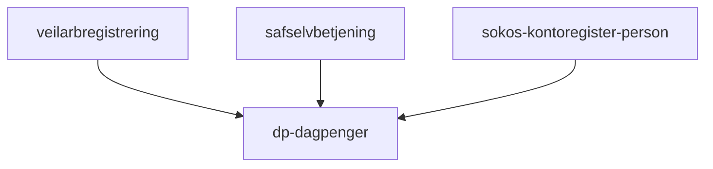

# Frontend

Innsynnside for dagpenger.

## Formål

Bruker skal kunne se oversikt over dagpengersøknader bruker har sendt til NAV. Oversikt over dokumenter. Muligheter for å ta kontakt med NAV.

## Teknologier

- Rammeverk: next 12
- Testing: Jest 27
- Node 18.12.0
- MSW: 1.3.2

## App-arkitektur

Denne applikasjonen har bare èn side.

### Sidestruktur

#### PageHero

Side titel med arbeidssøkerstatus vi henter fra. Arbeidssøkerstatus er informasjon om bruker er registrert som arbeidssøker og det kan være enten "registert" eller "ikke registert".

#### Soknader

Lister over påbegynte og fullførte søknader siste 12 uker. Bruker kan fortsette med søknaden fra påbegynte søknader. Fullførte søknader har bruker muligheter for å se søknaden eller ettersende dokumenter.

#### AccountNumber

Vise kontonummer henter fra [Sokos kontoregister for person](https://github.com/navikt/sokos-kontoregister-person). Dersom bruker ikke har registert tidligere vil bruker får mulighet for å gjøre det.

#### MeldFraOmEndring

Denne seksjonen kan bruker sende melding til NAV eller sende inn dokument (Generell innsending)

#### Shortcut

Snarveier til **Send klage**, **Spørsmål om saken din**, **Forskudd på dagpenger** og **Ny søknad**

#### JournalpostList

Lister over dokumenter bruker har sendt inn tidligere med mulighet for å laste ned eller forhåndvise.

#### NosessionModal

Den viser en modal når sesjon er utløpt. Sesjonen varer 30 minutter.

### Eksterne tjenester / Netverkskart

TODO:

- Hvordan fungerer applikasjonen internt?

## Utfordringer

- Dokument håntering er vanskelig å forstår. Denne trenger omskriving/opprydding.
  - Kompleksiteten ligger mest i [Backend for Frontend](https://github.com/navikt/dp-dagpenger/blob/main/src/pages/api/dokumenter/index.ts)
- Vanskelig å oppdatere til neste Next og MSW.
- Bruker har ikke mulighet å følge med på søknadsstatus.
- Denne applikasjonen mangler oppsett for Faro.
- Ettersending av dokumenter kan gjøres kun èn gang. Dette må vi dobbeltsjekke om det fortsatt er en feil!

## Lenker

- [Github](https://github.com/navikt/dp-dagpenger)
- Grafana Faro
- [Amplitude](https://app.eu.amplitude.com/analytics/nav/dashboard/5z4xqqz)
- Oppgaver i favro
- [Tilgjengelighetserklæring](https://a11y-statement.nav.no/reports/1b32d0fd-983b-44f2-8f64-6f1ae6760c64)
- Annen bakgrunnsinformasjon
