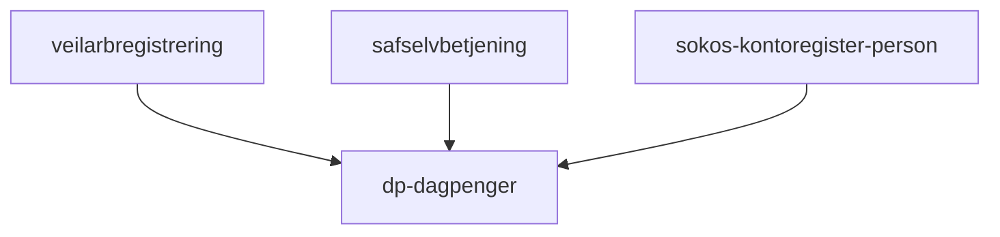

# Frontend

Innsynnside for dagpenger.

## Formål

Brukerne kan se oversikt over sine dagpengesøknader og innsendte dokumenter, og komme i kontakt med NAV.

## Teknologier

- Rammeverk: Next@12
- Testing: Jest@27
- Node: v18.12
- MSW: v1.3.2

## App-arkitektur

Denne applikasjonen har bare én side, bestående av komponentene `PageHero`, `Soknader`, `AccountNumber`, `MeldFraOmEndring`, `Shortcut`, `JournalpostList`, og `NosessionModal`.

### PageHero

Sidetittel med arbeidssøkerstatus, og kan være enten "registert" eller "ikke registert".

### Soknader

Lister over påbegynte og fullførte søknader siste 12 uker. Bruker kan fortsette med søknaden fra påbegynte søknader. Hen kan også se fullførte søknader og ettersende dokumentasjon.

### AccountNumber

Kontonummer hentes fra [Sokos kontoregister for person](https://github.com/navikt/sokos-kontoregister-person). Dersom bruker ikke har registert dette tidligere vil bruker få mulighet for å gjøre det.

### MeldFraOmEndring

I denne seksjonen kan bruker sende melding til NAV, eller sende inn dokumenter (generell innsending).

### Shortcut

Snarveier til **Send klage**, **Spørsmål om saken din**, **Forskudd på dagpenger** og **Ny søknad**.

### JournalpostList

Lister over dokumenter brukeren har sendt inn tidligere, med mulighet for å laste ned eller forhåndvise.

### NosessionModal

Hvis sesjonen er utløpt vises en denne modalen. Sesjonen varer i 30 minutter.

## Nettverkskart

## Utfordringer

- Dokumenthåntering er vanskelig å forstå. Denne trenger omskriving/opprydding.
  - Kompleksiteten ligger mest i [backend for frontend](https://github.com/navikt/dp-dagpenger/blob/main/src/pages/api/dokumenter/index.ts)
- Vanskelig å oppdatere til neste versjon av Next og MSW.
- Bruker har ikke mulighet å følge med på søknadsstatus.
- Denne applikasjonen mangler oppsett for Faro.
- Ettersending av dokumenter kan gjøres kun én gang. Dette må vi dobbeltsjekke om det fortsatt er en feil!

## Lenker

- [Github](https://github.com/navikt/dp-dagpenger)
- Grafana Faro
- [Amplitude](https://app.eu.amplitude.com/analytics/nav/dashboard/5z4xqqz)
- Oppgaver i Favro
- [Tilgjengelighetserklæring](https://a11y-statement.nav.no/reports/1b32d0fd-983b-44f2-8f64-6f1ae6760c64)
