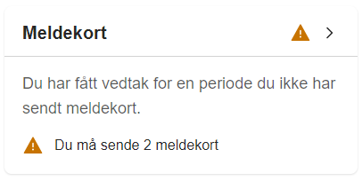
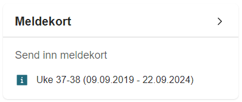
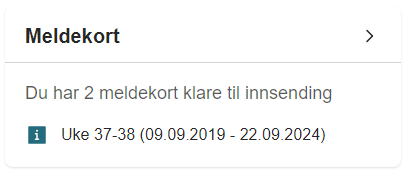
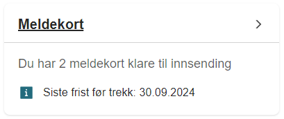
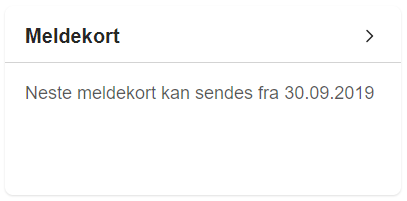

# Meldekort-mikrofrontend

Førts henter applikasjonen data fra `%MELDEKORT_API_URL%/meldekort/api/person/meldekortstatus` gjennom `tms-min-side-proxy`
og får MeldekortDataFraApi som er et objekt med felter (navn: type)
```
{
  antallGjenstaaendeFeriedager: number;
  etterregistrerteMeldekort: number;
  meldekort: number;
  nesteInnsendingAvMeldekort: string | null;
  nesteMeldekort: NesteMeldekortFraApi | null;
}
```
hvor NesteMeldekortFraApi er et objekt med felter
```
{
  fra: string;
  til: string;
  uke: string;
  kanSendesFra: string;
}
```

Applikasjonen viser en feilmelding ("Klarte ikke å hente meldekortdata") hvis det var en feil ved henting av data.
Applikasjonen viser ingenting hvis data er tom (det betyr at bruker ikke har meldeplikt).

Hvis data ikke er tom, sjekker applikasjonen om det finnes meldekort for etterregistrering, meldekort som kan sendes nå og meldekort som ikke kan sendes ennå og viser:
- hvis det finnes meldekort for etterregistrering:
  Du har fått vedtak for en periode du ikke har sendt meldekort. Du må sende %count% meldekort / You have received a decision for a period in which you have not sent employment status form. You must send %count% employment status forms
  

- hvis det finnes meldekort som kan sendes nå:
  Send inn meldekort / Submit employment status form
  eller
  Du har %count% meldekort klare til innsending / You have %count% employment status forms ready to be sent
  
  

  I tillegg når man risikerer trekk, viser applikasjonen:
  Siste frist før trekk: %count% / The final submission deadline without reduced payout: %count%
  

- hvis de finnes meldekort som ikke kan sendes ennå:
  Neste meldekort kan sendes fra %count% / The next employment status form can be sent on %count%
  
