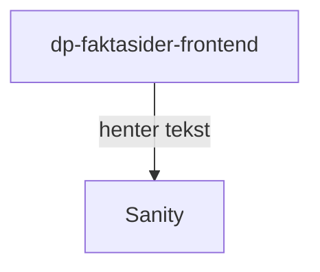

# Faktasider (historisk)

Applikasjonen er dagpengers gamle informasjonsside, og er tilgjengelig på [nav.no/arbeid/historikk](https://nav.no/arbeid/historikk).

## Formål

Tjenesten eksisterer for å vise de historiske informasjonssidene til dagpenger, før overgangen til dp-produktsiden. Dataene er lagret i [Sanity](/innbyggerflate/losninger/navno/sanity), men er ikke tilgjengelig for redigering.

_TODO: I hvilket tidsrom var informasjonen som vises her gyldig?_

## Teknologier

- Rammeverk: next@12
- Testing: Cypress (ikke i bruk)
- Node: lts/\*

## App-arkitektur

## Utfordringer

- Applikasjonen henter data fra Sanity, selv om dataen ikke endres. Foreslår at disse dataene ligger som en statisk fil i selve repoet.
- Applikasjonen er skrevet med Next, men viser kun statisk innhold, så den bør kunne forenkles for å lette vedlikeholdsarbeidet.
- For å unngå unødvendig arbeid med å vedlikeholde tester kjøres ikke disse lenger, og bør fjernes.

## Lenker

- [Github](https://github.com/navikt/dp-faktasider-frontend)
- [nav.no](https://www.nav.no/arbeid/historikk)
- Grafana Faro
- Amplitude
- Oppgaver i favro
- Annen bakgrunnsinformasjon
