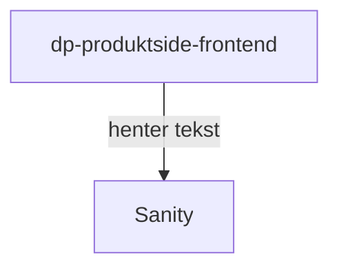

# Produktsiden

Applikasjonen viser informasjon om dagpenger på [nav.no](https://www.nav.no/dagpenger) og er veien videre for _all things dagpenger_.

## Formål

TODO: Hvorfor eksisterer denne applikasjonen, og hvilke problem løser den?

## Teknologier

- Rammeverk: next@13
- Node: lts/\*

## App-arkitektur

TODO:

- Hvordan fungerer applikasjonen internt?
- Hvilke andre applikasjoner kommuniserer denne direkte med?

## Utfordringer

TODO: Hvilke utfordringer har denne applikasjonen? F.eks. med hvordan den er strukturert, vanskelig å oppgradere, utdaterte avhengigheter

## Lenker

- [Github](https://github.com/navikt/dp-produktside-frontend)
- [nav.no](https://www.nav.no/dagpenger)
- Grafana Faro
- Amplitude
- Oppgaver i favro
- Annen bakgrunnsinformasjon
