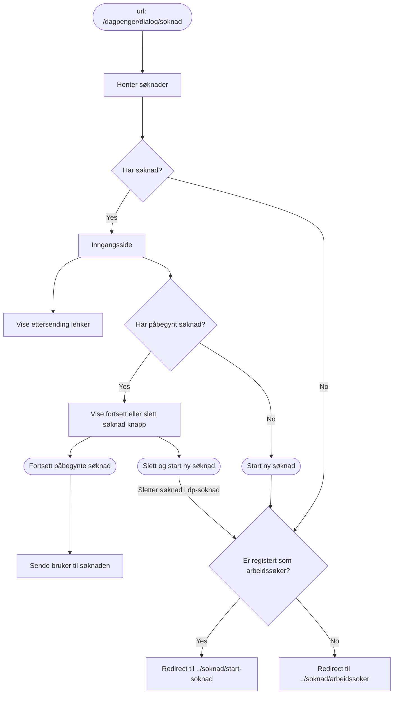
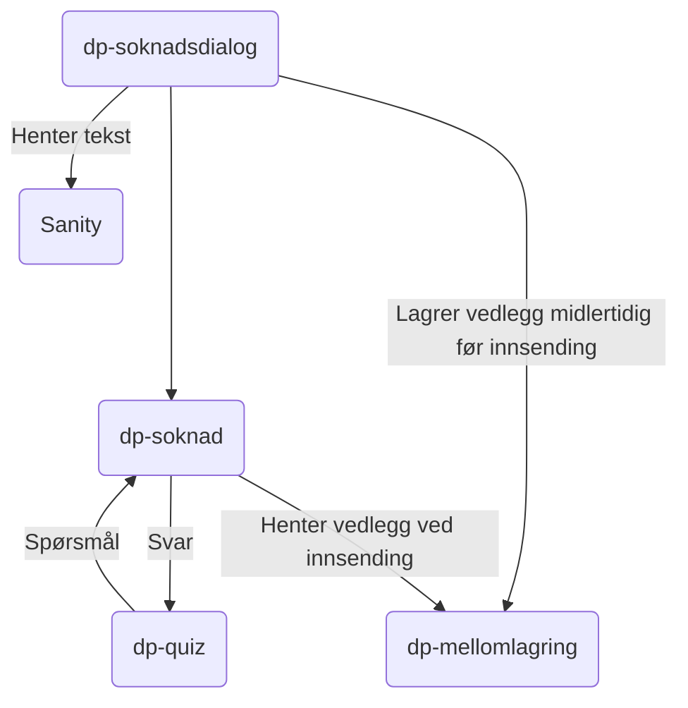

# Søknadsdialog

TODO: Kort introduksjon om applikasjonen, og er det unntak fra normalen (ikke i prod, bare i livsforlengende behandling)?

## Formål

dp-soknadsdialog er designet med hensikten om å effektivisere og forbedre den digitale innsendingen av dagpengesøknader for brukerne.
Spesifikt er formålet med denne applikasjonen å fungere som et grensesnitt mellom sluttbrukeren og de underliggende systemene,
spesielt _dp-soknad_, _dp-mellomlagring_ og _dp-quiz_.

## Teknologier

- Rammeverk: next@14
- Testing: Vitest
- Node: v18.17

## App-arkitektur

### Inngangssiden

Når bruker kommer inn på https://www.nav.no/dagpenger/dialog/soknad sjekker vi om bruker fullført- eller påbegynte søknader og om bruker er registert som arbeidssøker. Dette gjør for å kunne vise bruker riktig informasjon eller redirecte bruker til riktig sider. Slik ser flyten ut:

### Slik fungerer løsningen

1. **Verifisering av brukerens arbeidssøkerstatus**:

- Før man kan sende en søknad, må brukeren være registrert som arbeidssøker.
  _dp-soknadsdialog_ har integrasjon med _veilarbregistrering_ for å hente verifisere brukerens status som arbeidssøker.

2. **Starte Ny Søknad**:

- _dp-soknadsdialog_ fungerer som en klient for _dp-soknad_, og gir brukerne muligheten til å enkelt starte en ny dagpengesøknad. Dette skjer i samarbeid med _dp-mellomlagring_, hvor vedlegg midlertidig lagres under søknadsprosessen.

3. **Fullføre eksisterende Søknader:**

- Brukerne har muligheten til å starte en ny søknad uten å fullføre den, og denne ufullstendige søknaden lagres som en kladd i dp-soknad. _dp-søknadsdialog_ henter ufullstendige søknader fra dp-soknad, og samtidig forsikrer applikasjonen om at allerede opplastede vedlegg blir pålitelig lagret i _dp-mellomlagring_. Dette sikrer kontinuiteten i søknadsprosessen og gir brukerne fleksibilitet til å fullføre søknaden i sitt eget tempo.

  :::warning[Adversel]
  Inaktive søknader slettes innen en uke for å iverata personvern og unngå lagring av unødvendig data.

  :::

4. **Hente nye Spørsmål via dp-quiz:**

- _dp-søknadsdialog_ presenterer brukerne dynamiske spørsmål fra _dp-soknad_ via dp-quiz, hvor hvert svar fra brukeren utløser nye relevante spørsmål. Løsningen fungerer som en bindeledd, uten å håndtere forretningslogikk, og viderefører dialogen mellom brukeren og dp-soknad.

5. **Effektiv lagring av Vedlegg:**

- Vedlegg fra brukerne lagres midlertidig av _dp-søknadsdialog_ i _dp-mellomlagring_. Dette bidrar til å organisere og bevare alle nødvendige dokumenter knyttet til søknaden samt forbedre søknadsprosessen.

6. **Innsending av Søknaden:**

- Ved innsending av søknaden, kommuniserer _dp-soknad_ med _dp-mellomlagring_ for å hente vedlegg og informasjon. Dette resulterer i et oppsummeringsdokument som inkluderer spørsmål, svar og vedlegg. Denne informasjonen blir senere journalført for å sikre en nøye dokumentert søknadsprosess.

Oppsumert fungerer _dp-søknadsdialog_ som en bindeledd mellom sluttbrukeren og de underliggende systemene for dagpengesøknadsprosessen ved å effektivt koble sammen dp-soknad, dp-quiz og _dp-mellomlagring_.
Applikasjonen forenkler søknadsprosessen for brukerne, ivaretar midlertidig lagring av vedlegg og legger til rette for en sømløs overgang fra søknad til journalføring

### Kommunikasjonsflyt

## Utfordringer

TODO: Hvilke utfordringer har denne applikasjonen? F.eks. med hvordan den er strukturert, vanskelig å oppgradere, utdaterte avhengigheter

## Lenker

- [dp-soknadsdialog](https://github.com/navikt/dp-soknadsdialog)
- [dp-soknad](https://github.com/navikt/dp-soknad)
- [dp-mellomlagring](https://github.com/navikt/dp-mellomlagring)
- [dp-quiz](https://github.com/navikt/dp-quiz)
- [nav.no](https://www.nav.no/dagpenger/dialog)
- Grafana Faro
- Amplitude
- Oppgaver i favro
- Annen bakgrunnsinformasjon
