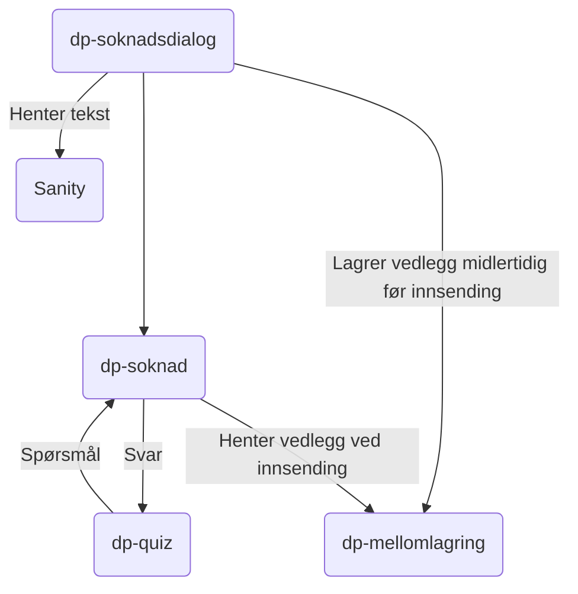

# Søknadsdialog

TODO: Kort introduksjon om applikasjonen, og er det unntak fra normalen (ikke i prod, bare i livsforlengende behandling)?
## Formål

dp-soknadsdialog er designet med hensikten om å effektivisere og forbedre den digitale innsendingen av dagpengesøknader for brukerne.
Spesifikt er formålet med denne applikasjonen å fungere som et grensesnitt mellom sluttbrukeren og de underliggende systemene,
spesielt *dp-soknad*, *dp-mellomlagring* og *dp-quiz*. 
## Teknologier

- Rammeverk: next@14
- Testing: Vitest
- Node: v18.17

## App-arkitektur

### Slik fungerer løsningen

1. **Verifisering av brukerens arbeidssøkerstatus**:
- Før man kan sende en søknad, må brukeren være registrert som arbeidssøker. 
*dp-soknadsdialog* har integrasjon med *veilarbregistrering* for å hente verifisere brukerens status som arbeidssøker. 
2. **Starte Ny Søknad**:
- *dp-soknadsdialog* fungerer som en klient for *dp-soknad*, og gir brukerne muligheten til å enkelt starte en ny dagpengesøknad. Dette skjer i samarbeid med *dp-mellomlagring*, hvor vedlegg midlertidig lagres under søknadsprosessen.
3. **Fullføre eksisterende Søknader:**
- Brukerne har muligheten til å starte en ny søknad uten å fullføre den, og denne ufullstendige søknaden lagres som en kladd i dp-soknad. *dp-søknadsdialog* henter ufullstendige søknader fra dp-soknad, og samtidig forsikrer applikasjonen om at allerede opplastede vedlegg blir pålitelig lagret i *dp-mellomlagring*. Dette sikrer kontinuiteten i søknadsprosessen og gir brukerne fleksibilitet til å fullføre søknaden i sitt eget tempo.

  :::warning[Adversel]
  Inaktive søknader slettes innen en uke for å iverata personvern og unngå lagring av unødvendig data.

  :::

4. **Hente nye Spørsmål via dp-quiz:**
- *dp-søknadsdialog* presenterer brukerne dynamiske spørsmål fra *dp-soknad* via dp-quiz, hvor hvert svar fra brukeren utløser nye relevante spørsmål. Løsningen fungerer som en bindeledd, uten å håndtere forretningslogikk, og viderefører dialogen mellom brukeren og dp-soknad.
5. **Effektiv lagring av Vedlegg:**
- Vedlegg fra brukerne lagres midlertidig av *dp-søknadsdialog* i *dp-mellomlagring*. Dette bidrar til å organisere og bevare alle nødvendige dokumenter knyttet til søknaden samt forbedre søknadsprosessen.
6. **Innsending av Søknaden:**
- Ved innsending av søknaden, kommuniserer *dp-soknad* med *dp-mellomlagring* for å hente vedlegg og informasjon. Dette resulterer i et oppsummeringsdokument som inkluderer spørsmål, svar og vedlegg. Denne informasjonen blir senere journalført for å sikre en nøye dokumentert søknadsprosess.

Oppsumert fungerer *dp-søknadsdialog*  som en bindeledd mellom sluttbrukeren og de underliggende systemene for dagpengesøknadsprosessen ved å effektivt koble sammen dp-soknad, dp-quiz og *dp-mellomlagring*. 
Applikasjonen forenkler søknadsprosessen for brukerne, ivaretar midlertidig lagring av vedlegg og legger til rette for en sømløs overgang fra søknad til journalføring 

### Kommunikasjonsflyt

## Utfordringer

TODO: Hvilke utfordringer har denne applikasjonen? F.eks. med hvordan den er strukturert, vanskelig å oppgradere, utdaterte avhengigheter

## Lenker

- [dp-soknadsdialog](https://github.com/navikt/dp-soknadsdialog)
- [dp-soknad](https://github.com/navikt/dp-soknad)
- [dp-mellomlagring](https://github.com/navikt/dp-mellomlagring)
- [dp-quiz](https://github.com/navikt/dp-quiz)
- [nav.no](https://www.nav.no/dagpenger/dialog)
- Grafana Faro
- Amplitude
- Oppgaver i favro
- Annen bakgrunnsinformasjon
