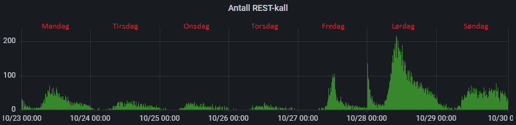

# Meldeplikt

Når man får DP (Dagpenger, https://www.nav.no/dagpenger), AAP (Arbeidsavklaringspenger, https://www.nav.no/aap) eller TP (Tiltakspenger, https://www.nav.no/tiltakspenger) har man meldeplikt, dvs. man må sende meldekort hver fjortende dag.

Team Dagpenger "arvet" ansvaret for å gjøre endringer og oppgraderinger i meldekort-løsningen fordi alle fra Team Meldekort ble flyttet til Team Dagpenger.  
Dagpenger-delen i meldekort-løsningen skal erstattes med dp-rapportering-frontend.  
Team Dagpenger tenkte å prøve den nye løsningen med begrenset antall brukere først. For å velge brukere som skulle sendes til den nye løsningen, ble opprettet en mekanisme som sjekker hvem som skal sendes:  
- Det finnes en tabell i meldkort-api sin database som inneholder fødselsnummer  
- Hvis fødselsnumeret til bruker er i denne tabellen, sendes brukeren til den nye løsningen


## Applikasjoner
https://github.com/navikt/meldekort (frontend)  
https://github.com/navikt/meldekort-mikrofrontend  
https://github.com/navikt/meldekort-api  
https://github.com/navikt/meldekortservice  
https://github.com/navikt/meldekortkontroll-api  

**VIKTIG!**  
Tekster som vises i meldekort-frontend kommer fra meldekort-api. Vi må vise de tekstene som var gyldige for det valgte meldekortet (for den meldeperioden).  
Det finnes fortsatt 2 filer med tekster i meldekort (src\app\mock\responses\tekster_nb.json og src\app\mock\responses\tekster_en.json),
men disse er ment for lokalkjøring/testing og inneholder ikke alle/siste versjoner av tekstene.  
meldekort-api har en tabell med tekstene i sin database. Denne tabellen er fylt ut ved hjelp av R__recreate_texts-migrasjonen og har disse kolonnene:  
- kode  
- verdi  
- sprak  
- fra_dato

For å opprette en tekst i denne tabellen må man skrive i R__recreate_texts, f.eks:
```sql
INSERT INTO tekst (kode, verdi, sprak,  fra_dato) VALUES ('overskrift.bruttoBelop', 'Brutto beløp ', 'nb',  TO_DATE('1000-01-01', 'YYYY-MM-DD'));
INSERT INTO tekst (kode, verdi, sprak,  fra_dato) VALUES ('overskrift.bruttoBelop', 'Gross amount ', 'en',  TO_DATE('1000-01-01', 'YYYY-MM-DD'));
```

Dato 1000-01-01 betyr at denne teksten skal i praksis gjelde for alle meldekort

For å ha forskjellige versjoner av samme tekst:
```sql
INSERT INTO tekst (kode, verdi, sprak,  fra_dato) VALUES ('textKode', 'Tekst v1 ', 'nb',  TO_DATE('1000-01-01', 'YYYY-MM-DD'));
INSERT INTO tekst (kode, verdi, sprak,  fra_dato) VALUES ('textKode', 'Text v1 ',  'en',  TO_DATE('1000-01-01', 'YYYY-MM-DD'));
INSERT INTO tekst (kode, verdi, sprak,  fra_dato) VALUES ('textKode', 'Tekst v2 ', 'nb',  TO_DATE('2023-10-29', 'YYYY-MM-DD'));
INSERT INTO tekst (kode, verdi, sprak,  fra_dato) VALUES ('textKode', 'Text v2 ',  'en',  TO_DATE('2023-10-29', 'YYYY-MM-DD'));
```

Da skal v1 vises når man har en aktiv meldeperiode som er før 2023-10-29 og v2 skal vises for meldeperioder etter 2023-10-29


## Arkitekrur


## Utvikling

Vanlig utviklingsprosess:  
1. Opprett en ny branch  
2. Gjør nødvendige endringer i denne branchen  
3. Deploy branchen til Q1 og/eller Q2. For å gjøre dette:  
Åpne GitHub repo > Actions > Build and Deploy to dev > Run workflow > Velg riktig branch, velg miljø Q1 eller Q2 > Run workflow  
4. Sjekk endringene i Q1 og/eller Q2  
5. Opprett en pull request  
6. Når PRen er sjekket, merge branchen til master  
7. Bygg release. For å gjøre dette:  
Åpne GitHub repo > Actions > Build and Deploy to dev > Run workflow > Velg master branch, velg miljø Q1 eller Q2, velg bump > Run workflow  
8. Deploy release til prod *. For å gjøre dette:  
Åpne GitHub repo > Actions > Deploy release to dev or prod > Run workflow > Velg master branch, skriv inn "p" som Miljø, skriv inn den versjonen som skal deployes > Run workflow  
9. Sjekk at alt fungerer **  
10. Oppdater https://confluence.adeo.no/display/TMP/Versjonsoversikt

***OBS!**  
Flertallet sender meldekortene sine fra fredag til mandag. 
Det betyr at det ikke er veldig smart å deploye noe til prod i disse dagene med mindre det er en prodfeil fiks.
Det er bedre å deploye til prod fra tirsdag til torsdag.


*Antall REST-kall for å kontrollere meldekort per ukedag fra mandag til søndag*

**Nyttig Grafana dashboard for å sjekke at alt fungerer og meldekort kommer inn:  
https://grafana.nais.io/d/rPG4uUC7k/meldekort-api?orgId=1&refresh=30s

Andre dashboards:  
https://grafana.nais.io/d/h_LlxHcVz/team-meldeplikt-nais-app-dashbord?from=now%2Fd&to=now&orgId=1&refresh=1m  
https://grafana.nais.io/d/531ynU5Vz/meldekortservice?orgId=1
